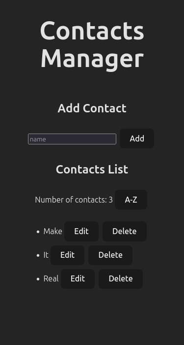

# Make It Real - Contact Management using JS and DOM

Solution to the **Contact Management using JS and DOM** project from the top fullstack program at MIR.

## Table of contents

- [Overview](#overview)
  - [The challenge](#the-challenge)
  - [Screenshot](#screenshot)
- [My process](#my-process)
  - [Built with](#built-with)
  - [What I learned](#what-i-learned)
  - [Continued development](#continued-development)
  - [Useful resources](#useful-resources)
- [Author](#author)
- [Acknowledgments](#acknowledgments)

## Overview

### The challenge

- A form:
  - Text field to enter the contact's name.
  - Button to add the contact.
  - Ensure the text field is not empty before adding a contact.
  - Avoid duplicates in the contact list.
- An empty list where the created contacts will be displayed:
  - Implement a contact counter that shows how many contacts are in the list.
  - Add functionality to sort the contacts alphabetically.
- When the user enters a name in the text field and clicks the "Add" button, the contact should appear in the list.
- Use localStorage to ensure the contacts persist even after reloading the page.
- Each contact in the list should have an Edit button and a Delete button.
- When clicking the "Delete" button next to a contact, it should be removed from the list.
- When clicking the "Edit" button, the contact's name should become editable. When clicking a "Save" button (which should replace the "Edit" button), the contact should be updated in the list with the new name.

### Screenshot



## My process

1. HTML structure (main, section, form)
2. Define functions (fetchContacts, addContact, validateNonEmptyField, checkForDuplicates, saveContacts, displayContacts, countContacts, editContact, deleteContact, sortContacts)
3. Add styles
4. End-to-end testing
5. Refactor

### Built with

- Semantic HTML5 markup
- CSS custom properties
- Flexbox
- Mobile-first workflow

### What I learned

Manipulating the DOM (appendChild, replaceChild, addEventListener, querySelector) and using localStorage.

```js
function updateStorage() {
  localStorage.setItem("contacts", JSON.stringify(contacts));
}

function fetchContacts() {
  const storedContacts = localStorage.getItem("contacts");
  if (storedContacts) {
    contacts = JSON.parse(storedContacts);
    contacts.forEach(renderContact);
    updateContactsCounter();
  }
}
```

### Continued development

I would like to learn how to use Jest for end-to-end testing, making it easier to refactor.

### Useful resources

- [ChatGPT](https://www.chatgpt.com) - This code was not generated using ChatGPT, but taking a declarative approach and ensuring that functions perform specific tasks allowed me to ask precise questions and receive useful responses from ChatGPT, such as the best way to implement certain logic.

## Author

- Linkedin - [Juan Alva](https://www.linkedin.com/juan-luis-alva)

## Acknowledgments

Thanks to Khristian Moreno for his teachings.
